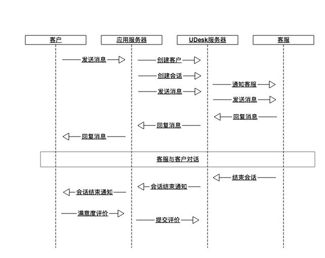

# Udesk IM ApiV2

## 更新记录

| 内容                                 | 日期       | 更新人 | 版本   |
|------------------------------------|----------|-----|------|
| 添加常见问答(重要)                        | 201700906 | 韦昭  | v1.1 |
| 添加客户是否会话中接口                        | 20170803 | 韦昭  | v1.0 |
| 发送消息 添加错误返回类型                      | 20170728 | 韦昭  | v0.4 |
| 文件类型暂不支持客服发送语音/视频                  | 20170724 | 韦昭  | v0.3 |
| info_transfer 不再给客户,客户收到的是 message | 20170724 | 韦昭  | v0.2 |
| 发送消息 im/messages 添加唯一标识 message_id | 20170721 | 韦昭  | v0.1 |

## 目录

<!-- TOC -->

- [Udesk IM ApiV2](#udesk-im-apiv2)
  - [更新记录](#更新记录)
  - [目录](#目录)
  - [交互流程](#交互流程)
  - [Udesk API 通用说明](#udesk-api-通用说明)
  - [创建客户](#创建客户)
  - [创建会话(请求分配客服)](#创建会话请求分配客服)
    - [请求参数](#请求参数)
    - [返回数据](#返回数据)
      - [机器人返回](#机器人返回)
      - [请求客服返回](#请求客服返回)
        - [**正确返回**](#正确返回)
        - [**排队返回**](#排队返回)
        - [**分配临界**](#分配临界)
        - [**客服不在线**](#客服不在线)
        - [** survey_options **](#-survey_options-)
  - [发送消息](#发送消息)
    - [请求参数](#请求参数-1)
    - [返回数据](#返回数据-1)
    - [错误返回](#错误返回)
  - [回复消息通知](#回复消息通知)
    - [请求方法](#请求方法)
    - [请求参数](#请求参数-2)
    - [返回数据](#返回数据-2)
  - [消息内容格式](#消息内容格式)
    - [type 类型及支持列表](#type-类型及支持列表)
    - [消息内容详情](#消息内容详情)
  - [机器人问答评价](#机器人问答评价)
    - [参数](#参数)
    - [返回](#返回)
  - [机器人评价](#机器人评价)
  - [会话评价](#会话评价)
    - [请求参数](#请求参数-3)
    - [返回数据](#返回数据-3)
  - [查询排队状态](#查询排队状态)
    - [请求参数](#请求参数-4)
    - [返回数据](#返回数据-4)
  - [查询客户状态](#查询客户状态)
    - [请求参数](#请求参数-5)
    - [返回数据](#返回数据-5)
  - [FAQ](#faq)
    - [我们想使用这个API接口,需要什么条件?](#我们想使用这个api接口需要什么条件)
    - [推送到我们指定服务器地址的请求是什么格式的 ?](#推送到我们指定服务器地址的请求是什么格式的-)
    - [我请求会话后返回客户不存在?](#我请求会话后返回客户不存在)
    - [我们的服务器收不到客服回复的消息,怎么确认Udesk是否推送过来?](#我们的服务器收不到客服回复的消息怎么确认udesk是否推送过来)
    - [为什么回复消息什么时候会返回多条消息?](#为什么回复消息什么时候会返回多条消息)

<!-- /TOC -->

## 交互流程



## Udesk API 通用说明

  文档参考 <http://www.udesk.cn/website/doc/apiv2/intro/>

## 创建客户

文档参考: <http://www.udesk.cn/website/doc/apiv2/customers/#_10>

## 创建会话(请求分配客服)

`POST /im/sessions`

### 请求参数

|     参数名     |  类型  | 必填 |                          说明                          |
|----------------|--------|------|--------------------------------------------------------|
| customer_token | 字符串 | 是   | 应用端客户唯一标识                                     |
| assign_type    | 字符串 | 否   | 期望的分配类型, 'robot', 'agent', 默认为 'robot'       |
| agent_id       | 整型   | 否   | 指定分配的客服id，如果指定忽略 assign_type 和 group_id |
| group_id       | 整型   | 否   | 指定分配的客服组id，如果指定忽略 assign_type           |
| channel        | 字符串 | 否   | 自定义渠道                                             |
| robot_role_id  | 字符串 | 否   | 客户角色                                               |

> customer_token 与创建客户时的 open_api_token 一致
> 如果 agent_id 和 group_id 都没有指定，且 assign_type 为 'agent'，则按系统分配规则分配  
> robot_role_id 需要先在云问端设置好


### 返回数据

| 属性名         | 类型  | 说明                     |
|-------------|-----|------------------------|
| code        | 整型  | 执行结果码，1000代表成功         |
| message     | 字符串 | 分配成功时为欢迎语，失败时为错误提示     |
| assign_type | 字符串 | 分配类型, 'robot', 'agent' |
| assign_info | 对象  | 分配结果信息                 |

根据 assign_type 不同 assign_info 的结构不同。

#### 机器人返回

assign_type 为 robot 时, assign_info 的结构如下:

| 属性名             | 类型  | 说明    |
|-----------------|-----|-------|
| robot_name      | 字符串 | 机器人姓名 |
| robot_avatar    | 字符串 | 机器人头像 |
| welcome_message | 字符串 | 欢迎语   |
| unknow_message  | 字符串 | 未知回答语 |

**示例**

```json
{
  "code": 1000,
  "message": "请求成功",
  "assign_type": "robot",
  "assign_info": {
    "robot_name": "Udesk客服机器人",
    "robot_avatar": "https://rd-dota.udesk.cn/entry/images/agent-avatar-3e6a68e1e1fcb4db653d9e93263f7946.png",
    "welcome_message": "<p>您好，我是智能客服机器人，我可以回答您相关的业务问题，有什么问题就问我吧！ 很高兴为您服务！</p><p><br/></p>",
    "unknow_message": "<p>对不起，我目前只能回答常见的业务相关问题！此问题暂不在我知识范围内，我会继续努力学习的！您也可以换个简单的问法向我提问，或许我就可以回答您了...</p>",
  }
}
```

#### 请求客服返回

assign_type 为 agent 时, assign_info 的结构如下:

| 属性名               | 类型  | 说明      |
|-------------------|-----|---------|
| im_sub_session_id | 整型  | 会话ID    |
| count             | 整型  | 排队位置    |
| agent_id          | 整型  | 分配的客服id |
| agent_name        | 字符串 | 分配的客服名称 |
| agent_avatar      | 字符串 | 客服头像地址  |
| survey_options    | 对象  | 满意度评价设置 |

##### **正确返回**

```json
{
  "code": 1000,
  "message": "请求成功",
  "assign_type": "agent",
  "assign_info": {
    "im_sub_session_id": 1234,
    "count": 0,
    "agent_id": 3,
    "agent_name": "Tom",
    "agent_avatar": "",
    "survey_options": "见survey_options一节",
  }
}
```

##### **排队返回**

```json
{
  "code": 2001,
  "message": "当前客服正繁忙，您排在第3位。",
  "assign_type": "agent",
  "assign_info": {
    "count": 3,
  }
}
```

##### **分配临界**

```json
{
  "code": 2001,
  "message": "客服分配中!",
  "assign_type": "agent",
  "assign_info": {
    "count": 0,
  }
}
```

##### **客服不在线**

```json
{
  "code": 2002,
  "message": "当前没有客服在线",
  "assign_type": "agent",
  "assign_info": {
    "count": 0,
  }
}
```

##### ** survey_options **

```yaml
"survey_options":
    "enabled": true,   # 是否开房
    "name": "满意度评价",
    "title": "您对本服务的评价是?",  # 给客户显示提示
    "desc": "感谢您的支持，为了使我们更好的为您服务，请您为本次服务做一个评价（回复字母即可）",  #微信微博API满意度评价引导语
    "remark_enabled": true,  # 是否可填写评价备注
    "remark": "您可填写评价备注", # 评价备注提示
    "options": [    #  评价选项/ id对应 /im_sessions/survey 的 option_id
      {
        "id": 36,
        "text": "超级满意2",
        "enabled": true
      },
      {
        "id": 37,
        "text": "满意2",
        "enabled": true
      },
      {
        "id": 38,
        "text": "一般2",
        "enabled": true
      },
      {
        "id": 39,
        "text": "不满意",
        "enabled": true
      },
      {
        "id": 40,
        "text": "非常不满意",
        "enabled": true
      }
    ],
    "methods": [  # 满意度评价方式
      {
        "id": 7,
        "flag": "after_session",
        "text": "对话结束后弹出",
        "enabled": true
      },
      {
        "id": 74,
        "flag": "agent_invite",
        "text": "客服主动邀请",
        "enabled": true
      },
      {
        "id": 1485,
        "flag": "customer_invite",
        "text": "客户主动满意度评价（仅支持web和Android/iOS SDK）",
        "enabled": true
      }
    ]
```

********************************

## 发送消息

API客户发送消息给客服

`POST /im/messages`

> 注意: 发送给机器人的消息 type 参数目前只支持 'message' 类型

### 请求参数

| 参数名               | 类型  | 必填  | 说明                                                       |
|-------------------|-----|-----|----------------------------------------------------------|
| customer_token    | 字符串 | 是   | 应用端客户唯一标识                                                |
| im_sub_session_id | 整型  | 是   | 会话ID / ID为0或空为机器人问题                                      |
| message_id        | 字符串 | 是   | 消息id/公司消息唯一标识                                            |
| type              | 字符串 | 否   | 消息类型, 'message', 'image', 'audio', 'rich', 默认为 'message' |
| data              | 对象  | 是   | 消息内容 (详情见 消息内容格式 一节)                                     |

### 返回数据

| 属性名  | 类型  | 说明             |
|------|-----|----------------|
| code | 整型  | 执行结果码，1000代表成功 |


### 错误返回

| code 值 | message 说明 |             |
|--------|------------|-------------|
| 1      | 9200       | 会话不存在/会话已关闭 |
| 2      | 2062       | 缺少参数        |

********************************

## 回复消息通知

### 请求方法

客服推送消息给API客户

`POST {接收消息URL}`

> 推送格式为 JSON
> 接收消息URL，请在管理员->设置->渠道管理->接口消息 中设置

### 请求参数

| 参数名            | 类型   | 必填  | 说明                     |
|----------------|------|-----|------------------------|
| customer_token | 字符串  | 是   | 应用端客户唯一标识              |
| assign_type    | 字符串  | 是   | 分配类型, 'robot', 'agent' |
| messages       | 对象数组 | 是   | 消息                     |

根据 assign_type 不同，message 的格式有所不同

当 assign_type 为 'robot' 时, message 的格式如下

```yaml
messages: 对像数组
  type: 消息类型
  message_id: 消息id, 字符串
  data: 消息内容
    question_id: 0为寒暄库，非问答; 非0时，可对问答进行有用无用评价
    question_title: 问题内容, 字符串
    answer: 问题答案文字, 字符串
    gus_list: 问题引导列表
      - question_title: 问题内容, 字符串
    relate_list: 相关问题列表
      - question_title: 问题内容, 字符串
    third_url: 相关推荐链接
      url: 链接地址, 字符串
```


```json
{
  "customer_token": "axb",
  "assign_type": "robot",
  "messages": [{
    "type": "message",
    "message_id": "f862f80d-89aa-4f31-92d9-ccd4fcacffcf",
    "data": {
      "question_id": 210530,
      "question_title": "公司业务是什么",
      "answer": "嗨,我们是做云客服的公司!不同开发就可以和微信微博web上的用户进行沟通和管理",
      "gus_list": [
        {"question_title": "你会什么业务"},
        {"question_title": "你们公司有什么业务"}
      ],
      "relate_list": [
        {"question_title": "公司在哪里"},
        {"question_title": "联系方式是什么"}
      ],
      "third_url": {
        "url": "http://www.udesk.cn"
      }
    }
  }
  ]
}
```

当 assign_type 为 'agent' 时, messages 的格式如下

```yaml
messages:
  type: 消息类型, 'message', 'image', 'audio', 'rich', 参见 <http://git.flyudesk.com/udesk/udesk_im/blob/master/doc/server/agent_logs.md>
  message_id: 消息id
  agent_id: 客服id
  agent_name: 客服名称
  agent_avatar: 客服头像
  im_sub_session_id: 会话ID
  message_created_at: 消息创建时间 "20170711 09:52:11"
  data: 与发送消息内容相同
    font: 字体, 仅支持message
    content: 内容
```

```json
{
  "customer_token": "axb",
  "assign_type": "agent",
  "messages": [
    {
    "type": "start_session",
    "message_id": "xxxxx",
    "agent_id": 1,
    "agent_name": "TOM",
    "agent_avatar": "http://123.com/1.png",
    "im_sub_session_id": 3,
    "message_created_at": "20170711 09:52:11",
    "data": {
      "content": "对话开始"
    }
    },{
    "type": "message",
    "message_id": "xxxxx",
    "agent_id": 1,
    "agent_name": "TOM",
    "agent_avatar": "http://123.com/1.png",
    "im_sub_session_id": 3,
    "message_created_at": "20170711 09:52:12",
    "data": {
      "font": "字体, 仅支持message",
      "content": "您好,有什么可以帮助您?",
    }
  },
  {
    "type": "rich",
    "message_id": "xxxxx",
    "agent_id": 1,
    "agent_name": "TOM",
    "agent_avatar": "http://123.com/1.png",
    "im_sub_session_id": 3,
    "message_created_at": "20170711 09:52:13",
    "data": {
      "content": "本公司促销产品走过路过不要错过 <a href=\"https://xxx.com/1.png\">热销.com</a>",
    }
  }]
}
```

### 返回数据

请在10秒内返回 HTTP Status Code 200，响应体为空，否则 UDesk 端会认为发送失败，并尝试重发

********************************

## 消息内容格式

### type 类型及支持列表

| 类型  | type           | 含义                     | 发送  | 接收  | 备注                                     |
|-----|----------------|------------------------|-----|-----|----------------------------------------|
| 消息  | message        | 文本消息                   | ✓   | ✓   |                                        |
| 消息  | image          | 图片消息                   | ✓   | ✓   |                                        |
| 消息  | audio          | 语言消息                   | ✓   | ×   | 暂不支持发送语音                               |
| 消息  | video          | 视频消息                   | ✓   | ×   | 暂不支持发送视频                               |
| 消息  | file           | 文件消息                   | ✓   | ✓   |                                        |
| 消息  | rich           | 富文本消息                  | ✓   | ✓   |                                        |
| 消息  | struct         | 结构话消息                  | ×   | ×   | 暂不支持                                   |
| 事件  | start_session  | 对话开始                   | ×   | ✓   | 对话开始时推给客户                              |
| 事件  | transfer       | 转接事件                   | ×   | ✓   | 客户被转接时推给客户,客户需要修改im_sub_session_id 为新的 |
| 事件  | info_transfer  | 转接事件显示内容               | ×   | ×   | 客户被转接时显示给客服的提示内容                       |
| 事件  | close          | 会话关闭事件                 | ×   | ✓   | 客户会话被关闭时推给客户                           |
| 事件  | survey         | 满意度评价相关事件              | ×   | ×   | 只会在客服IM工作台显示                           |
| 事件  | active_guest   | 客服主动会话事件               | ×   | ×   | 仅支持web访客                               |
| 事件  | info_appoint   | 客服分配客户事件               | ×   | ×   | 暂不支持                                   |
| 事件  | form           | 发送表单消息事件               | ×   | ×   | 暂不支持                                   |
| 事件  | form_received  | 接受表单消息事件               | ×   | ×   | 暂不支持                                   |
| 事件  | info           | 询前表单 is_receive: false | ×   | ×   | 仅用于客服显示                                |
| 事件  | robot_transfer | 机器人转接对话                | ×   | ×   | 仅用于客服显示                                |

> 注: 不支持/暂不支持/仅用于客服显示的消息,不要在客户端显示处理

### 消息内容详情

根据 type 类型，data 的结构也有所不同:

```yaml
# 普通消息
type: 'message'
data:
    font: 字体格式, 选填, 比如
    content: 文本内容  注: 文本内容可以包含 富文本 html 标签

# 图片消息
type: 'image'
data:
    content: url

# 语音消息
type: 'audio'
data:
    content: url
    filename: '足球.mp4' #
    filesize: "4.3M"
    duration: 200       # 语音时长,可能没有 # 单位为s

type: 'video'  # 仅支持mp4
data:
    content: url
    filename: '足球.mp4' # 文件名称
    filesize: "4.3M"    # 文件大小

type: 'rich'  # 支持
data:
    content: <p>您好，小雅客服很高兴为您服务，请问有什么可以帮您？</p>

# type: struct  结构化消息, 现仅支持 web/sdk
# 相关文档 <http://www.udesk.cn/website/doc/apiv1/im/#im_2>

# start_session 会话开始,通常为数组推送,后面有欢迎语 message 
type: "start_session",
data: 
  content: "对话开始"

# transfer 会话被转接,通常为数组推送,后面有转接内容 message 如: '会话转接成功,客服xx为您服务'
type: "transfer",
data: 
  content: "会话转接"

type: "info_transfer",
data: 
  content: "客服Jerry213转接会话"

type: "close",
data: 
  content: "会话关闭"

```

********************************

## 机器人问答评价

### 参数

| 参数名            | 类型  | 必填  | 说明            |
|----------------|-----|-----|---------------|
| customer_token | 字符串 | 是   | 应用端客户唯一标识     |
| message_id     | 字符串 | 是   | 所评价机器人答案的消息ID |
| question_id    | 整型  | 是   | 问题ID          |
| useful         | 布尔  | 是   | 问题是否有用        |


### 返回

| 属性名  | 类型  | 说明             |
|------|-----|----------------|
| code | 整型  | 执行结果码，1000代表成功 |

****************************************************************


## 机器人评价

TODO: 以后完善

****************************************************************

## 会话评价

`POST /im/sessions/survey`

### 请求参数

| 参数名               | 必填  | 说明     |
|-------------------|-----|--------|
| im_sub_session_id | 是   | 会话id   |
| option_id         | 是   | 评价选项id |
| remark            | 否   | 评价备注   |


### 返回数据

| 属性名  | 类型  | 说明             |
|------|-----|----------------|
| code | 整型  | 执行结果码，1000代表成功 |

********************************


## 查询排队状态

`GET /im/queue_status`

### 请求参数

| 参数名            | 必填  | 说明        |
|----------------|-----|-----------|
| customer_token | 是   | 应用端客户唯一标识 |

### 返回数据

| 属性名    | 类型  | 说明                               |
|--------|-----|----------------------------------|
| code   | 整型  | 执行结果码，1000代表成功                   |
| status | 字符串 | 排队状态, '排队中', '未排队', '会话中', '分配中' |
| count  | 整型  | 排队位置                             |

## 查询客户状态

用于查看客户是否在会话中,支持 customer_token / web_token / sdk_token 查询客户

`GET /im/customer_status`

### 请求参数

| 参数名            | 必填  | 说明                         |
|----------------|-----|----------------------------|
| customer_token | 否   | OpenApi 客户唯一标识             |
| web_token      | 否   | web 客户唯一标识                 |
| sdk_token      | 否   | sdk 客户唯一标识                 |
| session_key    | 否   | web_token 存在时,支持多会话不同的会话状态 |

**注: customer_token/web_token/sdk_token必须存在一个,按顺序取第一个有值参数**

### 返回数据

| 属性名         | 类型  | 说明                |
|-------------|-----|-------------------|
| code        | 整型  | 执行结果码，1000代表成功    |
| status_code | 整型  | 0,1,2,9             |
| status      | 字符串 | '无会话','会话中','排队中','无效客户' |

## FAQ

### 我们想使用这个API接口,需要什么条件?

此API接口是高级接口,需要开发量较大,要求较高.必须符合以下条件:

- 必须自建**即时通讯**平台.
  - Udesk只负责推送给您的服务器,不负责推送给您的客户.
  - 您必须已经拥有即时通讯平台或有自建即时通讯平台的能力,或是使用第三方平台
  - 如果您的客户都是 微信/微博 平台,可以认为已经拥有即时通讯平台
- 有很强的后台开发能力,需要进行如下工作
  - 维护客户信息,并把用户创建/更新到Udesk平台
  - 维护客户的会话
  - 维护对话内容,把客服回复客户的对话推送给客户
  - [可选] 维护满意度显示及结果

### 推送到我们指定服务器地址的请求是什么格式的 ?

POST请求,JSON格式.

### 我请求会话后返回客户不存在?

请求会话前需要请求创建客户,详见

- [交互流程](#交互流程)
- [创建客户](#创建客户)

### 我们的服务器收不到客服回复的消息,怎么确认Udesk是否推送过来?

建议

- 用nginx/apache 做前置,这样不管后端应用是不是处理正确,都能在前端 上看到日志是否收到请求
- 应用服务器先什么先只把收到的请求 body 打印到日志看下是不是到收请求,再进行业务逻辑开发

### 为什么回复消息什么时候会返回多条消息?

- 当一些事件和消息有强顺序绑定,如开始会话事件和欢迎语消息.